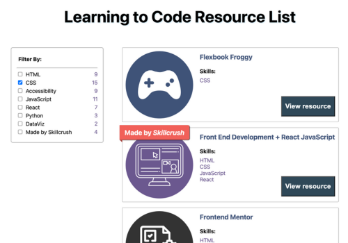

# learning-to-code-resource-list-with-filter
This app serves as a curated collection of coding learning resources, making it easy for users to find relevant content based on their interests or learning goals.

## Features
### Resource Filtering:
- Users can filter learning resources by different categories including HTML, CSS, Accessibility, JavaScript, React, Python, DataViz, and Skillcrush content
- Multiple filters can be selected simultaneously
- Filter counts show how many resources match each category
### Resource Display:
- Resources are displayed as cards with:
    - Resource name
    - Image/icon (blog, course, game, podcast, or project)
    - View resource button linking to the actual resource
    - Special flag for Skillcrush-created content
- Responsive Design:
    - Mobile-friendly layout that adapts to different screen sizes
    - On larger screens (>760px):
        - Filters appear as a sticky sidebar
        - Resources display in a grid layout
        - Larger resource cards with horizontal layout
- Visual Features:
    - Hover effects on resource cards
    - Color and icon-coded categories identify type of resource
    - Flag identifies resources created by Skillcrush
    - Clean, modern UI with consistent styling

## Running the project
To run the project, run command "npm run start".

## Dependencies
### Main dependencies:
- react: 16.8.6
- react-dom: 16.8.6
- react-scripts: 5.0.1
### Development dependencies:
- typescript: 3.3.3

## Future improvements
- A back-end for adding content from the browser

## Acknowledgements
Noticing the challenge of sharing resources with <a href="skillcrush.com" target="_blank">Skillcrush</a> students in the company’s Slack channel, I decided to augment a course project that filtered hotel rooms to share resources for learning to code. It was built in CodeSandbox with JavaScript React and image icons created in Canva. Then it was saved to GitHub and deployed on Netlify.